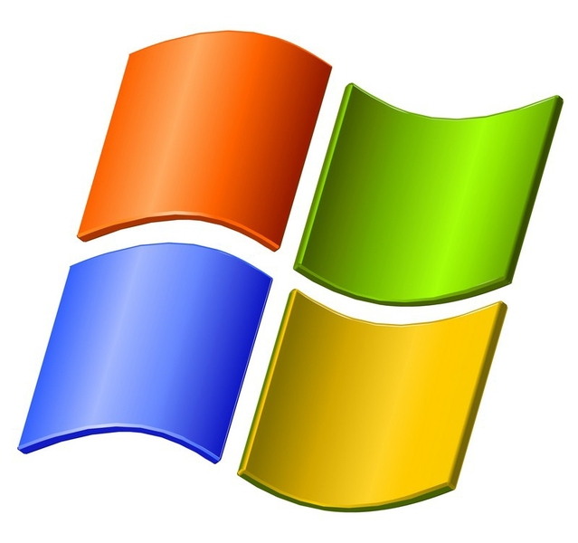
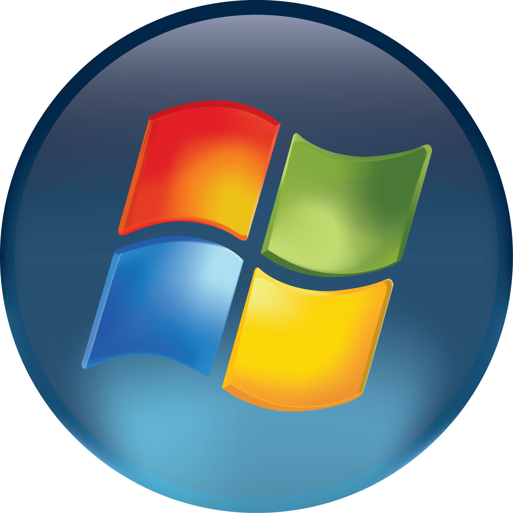
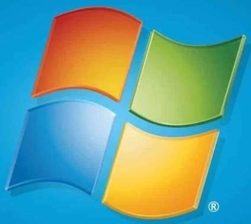
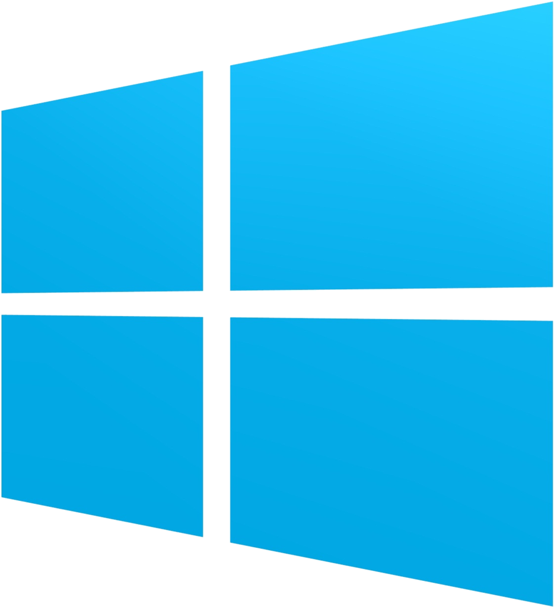
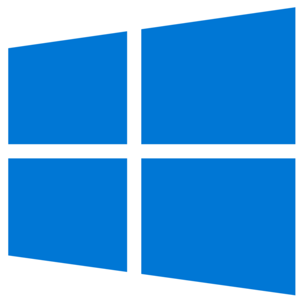
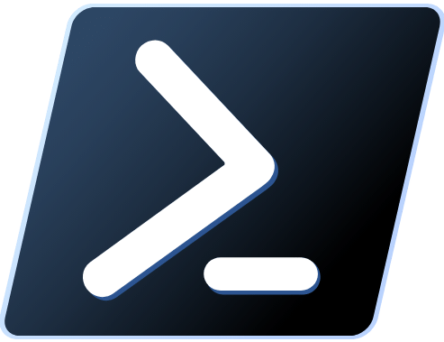

# Software Downloads 

Welcome to the Software Downloads repository, your ultimate destination for various software and tools tailored for different operating systems.

 

## Table of Contents
- [Utilities](#utilities)
- Operating Systems
  - [Windows](#windows)
  - [Linux](#linux)
- [Essential Tools](#essential-tools)
- [Others](#others)
- [Issues](#issues)

 

<!-- Utilities -->

#  &nbsp;Utilities

> Equip your system with these essential utilities.   

> **Prerequisite**: [Enable Virtualization](Enable_Virtualization.md) in your system BIOS for running virtual machines (VMs) efficiently.

<!-- VC Redist -->

&nbsp; &nbsp;<b>Visual C++ Redistributable Packages</b>

  <ul></ul>
  <ul>
    <li>Essential runtime components for running C++ applications built with Visual Studio.</li>
    <li><a href="https://aka.ms/vs/17/release/vc_redist.x64.exe">Download EXE</a> (24 MB)</li>
  </ul>

<!-- VMware -->

&nbsp; &nbsp;<b>VMware Workstation Pro 17</b>

  <ul></ul>
  <ul>
    <li>Leading virtualization software for running multiple operating systems on one machine.</li>
    <li><a href="https://download3.vmware.com/software/WKST-1751-WIN/VMware-workstation-full-17.5.1-23298084.exe">Download for Windows</a></li>
    <li><a href="https://download3.vmware.com/software/WKST-1751-LX/VMware-Workstation-Full-17.5.1-23298084.x86_64.bundle">Download for Linux</a></li>
  </ul>

<!-- VirtualBox -->

&nbsp; &nbsp;<b>VirtualBox</b>

  <ul></ul>
  <ul>
    <li>Free, open-source virtualization platform for creating and managing virtual machines.</li>
    <li><b>Windows Hosts</b></li>
    <ul>
      <li>VirtualBox 7.1.4 - <a href="https://download.virtualbox.org/virtualbox/7.1.4/VirtualBox-7.1.4-165100-Win.exe">Download</a>&nbsp;(106 MB)</li>
      <li>VirtualBox 7.1.2 - <a href="https://download.virtualbox.org/virtualbox/7.1.2/VirtualBox-7.1.2-164945-Win.exe">Download</a>&nbsp;(106 MB)</li>
    </ul>
  </ul>

<!-- eDEX-UI -->

&nbsp; <b>&nbsp;eDEX-UI</b>

  <ul></ul>
  <ul>
    <li>eDEX-UI is a fullscreen, cross-platform terminal emulator and system monitor that looks and feels like a sci-fi computer interface.</li>
    <li><a href="https://github.com/GitSquared/edex-ui/releases/download/v2.2.8/eDEX-UI-Windows-x64.exe">Download &nbsp;v2.2.8</a>&nbsp;(67 MB)</li>
  </ul>

<!-- Rufus -->

&nbsp; <b>&nbsp;Rufus</b>

  <ul></ul>
  <ul>
    <li>Utility for formatting and creating bootable USB drives.</li>
    <li><a href="https://github.com/pbatard/rufus/releases/download/v4.5/rufus-4.5.exe">Download &nbsp;v4.5</a>&nbsp;(1.3 MB)</li>
  </ul>

<!-- balenaEtcher -->

&nbsp; <b>&nbsp;balenaEtcher</b>

  <ul></ul>
  <ul>
    <li>Tool for flashing OS images to SD cards & USB drives, safely and easily.</li>
    <li><a href="https://github.com/balena-io/etcher/releases/download/v1.19.25/balenaEtcher-1.19.25.Setup.exe">Download &nbsp;v1.19.25</a>&nbsp;(174 MB)</li>
  </ul>

<!-- Ventoy -->

&nbsp; <b>&nbsp;Ventoy</b>

  <ul></ul>
  <ul>
    <li>Open-source tool to create a multiboot USB drive from ISO files.</li>
    <li><a href="https://github.com/ventoy/Ventoy/releases/download/v1.0.99/ventoy-1.0.99-windows.zip">Download &nbsp;v1.0.99</a>&nbsp;(16 MB)</li>
  </ul>

<!-- 7zip -->

&nbsp; <b>&nbsp;7-Zip</b>

  <ul></ul>
  <ul>
    <li>Open-source file archiver with a high compression ratio.</li>
    <li><a href="https://www.7-zip.org/a/7z2408-x64.exe">Download &nbsp;v24.08</a>&nbsp;(1.6 MB)</li>
  </ul>

<!-- FD Manager -->

&nbsp; <b>&nbsp;Free Download Manager</b>

  <ul></ul>
  <ul>
    <li>A powerful, user-friendly, and fast download accelerator and organizer.</li>
    <li><a href="https://files2.freedownloadmanager.org/6/latest/fdm_x64_setup.exe">Download &nbsp;v6.24.2</a>&nbsp;(43 MB)</li>
  </ul>

<!-- Marc Files -->

&nbsp; <b>&nbsp;Files for Android</b>

  <ul></ul>
  <ul>
    <li>A powerful, user-friendly, and fast file manager for Android devices.</li>
    <li><a href="https://play.google.com/store/apps/details?id=com.marc.files">Download from Google Play Store</a>&nbsp;(240 KB)</li>
  </ul>

 

# Operating Systems

<!-- Windows -->

##  &nbsp;Windows

> Upgrade your Windows experience with these operating systems

<!-- Windows XP -->

&nbsp; &nbsp;<b>Windows XP Professional</b>

  <ul></ul>
  <ul>
    <li>Classic Windows OS known for its stability and familiarity.</li>
    <li><a href="https://isoriver.com/download-your-file-now/?url=https://archive.org/download/WindowsXPProfessional64BitCorporateEdition/Windows%20XP%20Professional%2064-bit%20Corporate%20Edition%28CD%20Key%20VCFQD-V9FX9-46WVH-K3CD4-4J3JM%29.iso">Download ISO</a>&nbsp;(561 MB)</li>
    <li><b>Product Key:</b> <code>VCFQD-V9FX9-46WVH-K3CD4-4J3JM</code></li>
    <li>( RECOMMENDED ) Pre-configured Virtual machine for VirtualBox &nbsp;v7.0.18 - <a href="https://drive.google.com/file/d/1g_xNgn1Pjl3q6-uUYJeBcj4uA__0DNnz/view?usp=sharing">Download 7zip compressed</a>&nbsp;(768 MB)</li>
  </ul>

<!-- Windows Vista -->

&nbsp; &nbsp;<b>Windows Vista Ultimate</b>

  <ul></ul>
  <ul>
    <li>The transitional OS between XP and 7, featuring a new user interface and enhanced security.</li>
    <li><a href="https://archive.org/download/windows-vista-ultimate-sp-2-x-64-fully-updated/Windows%20Vista%20Ultimate%20SP2%20x64%20Fully%20Updated.iso">Download ISO</a>&nbsp;(4.6 GB)</li>
    <li><b>Product Key:</b> <code>VMCB9-FDRV6-6CDQM-RV23K-RP8F7</code></li>
    <li>( RECOMMENDED ) Pre-configured Virtual machine for VirtualBox &nbsp;v7.0.18 - <a href="https://drive.google.com/file/d/1nPwmDgO3npx4uFZrXKWrvDxpdoI2l9IY/view?usp=sharing">Download 7zip compressed</a>&nbsp;(3.24 GB)</li>
  </ul>

<!-- Windows 7 -->

&nbsp; &nbsp;<b>Windows 7 Ultimate</b>

  <ul></ul>
  <ul>
    <li>Popular OS featuring enhanced performance and security.</li>
    <li><a href="https://archive.org/download/win-7-ult-sp-1-english-x-64/Win7_Ult_SP1_English_x64.iso">Download ISO</a>&nbsp;(3.1 GB)</li>
    <li>( RECOMMENDED ) Pre-configured Virtual machine for VirtualBox &nbsp;v7.0.18 - <a href="https://1drv.ms/u/c/bd8d0e85b54e2c44/IQC51k-5V7NrRbyvRZ5aZ1aZAXg6jp2Yap4_uH9rpQgcpzY?e=gLLjFb">Download 7zip compressed</a>&nbsp;(2 GB)</li>
  </ul>

<!-- Windows 8.1 -->

&nbsp; &nbsp;<b>Windows 8.1 Professional</b>

  <ul></ul>
  <ul>
    <li>Improved version of Windows 8 with enhanced user experience.</li>
    <li><a href="https://windows-8-1-preview.en.uptodown.com/windows/download">Download ISO</a>&nbsp;(4 GB)</li>
    <li><b>Product Key:</b> <code>GCRJD-8NW9H-F2CDX-CCM8D-9D6T9</code></li>
    <li>( RECOMMENDED ) Pre-configured Virtual machine for VirtualBox &nbsp;v7.0.18 - <a href="https://1drv.ms/u/c/5ff34cdbdb104fe2/EeJPENvbTPMggF9sAAAAAAAB6OPL49heWADARtRPatWG8A?e=stXLEA">Download 7zip compressed</a>&nbsp;(3 GB)</li>
  </ul>

<!-- Windows 10 -->

&nbsp; &nbsp;<b>Windows 10</b>

  <ul></ul>
  <ul>
    <li>Latest version of Windows offering a host of new features and improvements.</li>
    <li><a href="https://go.microsoft.com/fwlink/?LinkId=2265055">Download Media Creation Tool</a>&nbsp;(19 MB)</li>
    <li>( RECOMMENDED ) Pre-configured Virtual machine for VirtualBox &nbsp;v7.1.10 - <a href="https://mega.nz/file/uoAiQLCL#mpP_sgHcBPGEVEuWr_RB-mAYjFGWZ8rJZSgcljBO6t8">Download 7zip compressed</a>&nbsp;(9 GB)</li>
  </ul>

<!-- Windows 11 -->

&nbsp; &nbsp;<b>Windows 11</b>

  <ul></ul>
  <ul>
    <li>Next-gen Windows experience with a redesigned UI and improved performance.</li>
    <li><a href="https://go.microsoft.com/fwlink/?linkid=2156295">Download Media Creation Tool</a>&nbsp;(10 MB)</li>
  </ul>

<!-- Activation Instructions -->

&nbsp;<b>Activation Instructions for Windows - 10 & 11</b>

  <ul></ul>
  <ol>
    <li><a href="https://support.microsoft.com/en-us/windows/turn-off-defender-antivirus-protection-in-windows-security-99e6004f-c54c-8509-773c-a4d776b77960">Turn off Windows Defender</a> in Windows Security.</li>
    <li>Download the activation file to your Desktop by the following CMD command:</li>
    <code>bash curl -o "%USERPROFILE%\Desktop\Activator.bat" https://raw.githubusercontent.com/Raqeeb27/MyResourceHub/main/Software_Downloads/Activator.bat</code>
    <li>Run the downloaded file <code>Activator.bat</code> as Administrator to activate Windows.</li>
    <li>If the file executes successfully, then restart your Windows.</li>
  </ol>

 

<!-- Linux -->

##  &nbsp; Linux

> Explore the world of Linux with these distributions

<!-- Termux -->

&nbsp; &nbsp;<b>Termux (for Android)</b>

  <ul></ul>
  <ul>
    <li>Terminal emulator for Android that provides a Linux environment with shell access.</li>
    <li>Supports Linux commands, SSH, Python, Git, and various development tools.</li>
  </ul>
  <ul>
    <li><b>Termux Application <i>v0.119.0-beta.2</i></b> - <a href="https://f-droid.org/repo/com.termux_1021.apk">Download APK</a>&nbsp;(102 MB)</li>
    <li><b>Termux API <i>v0.51.0</i></b> - <a href="https://f-droid.org/repo/com.termux.api_1000.apk">Download APK</a>&nbsp;(2.7 MB)</li>
    <li><b>Termux Styling plugin <i>v0.32.1</i></b> - <a href="https://f-droid.org/repo/com.termux.styling_1000.apk">Download APK</a>&nbsp;(31 MB)</li>
  </ul>

<!-- Arch -->

&nbsp; &nbsp;<b>Arch</b>

  <ul></ul>
  <ul>
    <li>Lightweight and flexible Linux distribution for users who want to customize their system.</li>
    <li><b>Arch 2024.10.01</b> - <a href="https://in-mirror.garudalinux.org/archlinux/iso/2024.10.01/archlinux-2024.10.01-x86_64.iso">Download ISO</a>&nbsp;(1.1 GB)</li>
  </ul>

<!-- EndeavourOS -->

&nbsp; &nbsp;<b>EndeavourOS</b>

  <ul></ul>
  <ul>
    <li>Arch-based distribution that offers a user-friendly setup and maintains Arch’s simplicity.</li>
    <li><b>Arch 2024.10.01</b> - <a href="https://mirror.nag.albony.in/endeavouros/iso/EndeavourOS_Endeavour_neo-2024.09.22.iso">Download ISO</a>&nbsp;(2.8 GB)</li>
  </ul>

<!-- Fedora -->

&nbsp; &nbsp;<b>Fedora</b>

  <ul></ul>
  <ul>
    <li>Cutting-edge Linux distribution with a focus on innovation and new technologies.</li>
    <li><b>Arch 2024.10.01</b> - <a href="https://download.fedoraproject.org/pub/fedora/linux/releases/40/Workstation/x86_64/iso/Fedora-Workstation-Live-x86_64-40-1.14.iso">Download ISO</a>&nbsp;(2.1 GB)</li>
  </ul>

<!-- Kali -->

&nbsp; &nbsp;<b>Kali Linux 2024.3</b>

  <ul></ul>
  <ul>
    <li>Leading penetration testing platform with advanced tools for ethical hackers.</li>
    <li><a href="https://cdimage.kali.org/kali-2024.3/kali-linux-2024.3-installer-amd64.iso">Download ISO</a>&nbsp;(4 GB)</li>
    <li>Virtual machine (7zip compressed) for <a href="https://cdimage.kali.org/kali-2024.3/kali-linux-2024.3-vmware-amd64.7z">VMware</a>&nbsp;(3.1 GB)</li>
    <li>Virtual machine (7zip compressed) for <a href="https://cdimage.kali.org/kali-2024.3/kali-linux-2024.3-virtualbox-amd64.7z">VirtualBox</a>&nbsp;(3.1 GB)</li>
    <li>( RECOMMENDED ) Pre-configured Virtual machine for VirtualBox &nbsp;v7.1.4 - <a href="https://drive.google.com/file/d/1ISxDcasxpIKEo3gNUCXHhoxlYdOHqaeB/view?usp=sharing">Download 7zip compressed</a>&nbsp;(8.3 GB)</li>
  </ul>

<!-- Parrot OS -->

&nbsp; &nbsp;<b>Parrot OS</b>

  <ul></ul>
  <ul>
    <li>Security-focused Linux distribution for developers and privacy-conscious users.</li>
    <li><b>Security Edition</b></li>
    <ul>
      <li><a href="https://deb.parrot.sh/parrot/iso/6.1/Parrot-home-6.1_amd64.iso">Download ISO</a>&nbsp;(2.2 GB)</li>
      <li><a href="https://deb.parrot.sh/parrot/iso/6.1/Parrot-security-6.1_amd64.ova">Download OVA file for VirtualBox</a>&nbsp;(7.6 GB)</li>
    </ul>
    <li><b>Home Edition</b></li>
    <ul>
      <li><a href="https://deb.parrot.sh/parrot/iso/6.1/Parrot-security-6.1_amd64.iso">Download ISO</a>&nbsp;(2.2 GB)</li>
      <li><a href="https://deb.parrot.sh/parrot/iso/6.1/Parrot-home-6.1_amd64.ova">Download OVA file for VirtualBox</a>&nbsp;(2.8 GB)</li>
    </ul>
  </ul>

<!-- Pop!_OS -->

&nbsp; &nbsp;<b>Pop!_OS</b>

  <ul></ul>
  <ul>
    <li>A Linux distribution developed by System76, tailored for developers, makers, and computer science professionals.</li>
    <li><b>Pop!_OS 24.04 LTS</b> - <a href="https://iso.pop-os.org/22.04/amd64/intel/43/pop-os_22.04_amd64_intel_43.iso">Download ISO</a>&nbsp;(2.5 GB)</li>
    <li><b>NVIDIA version:</b> - <a href="https://iso.pop-os.org/22.04/amd64/nvidia/43/pop-os_22.04_amd64_nvidia_43.iso">Download ISO</a>&nbsp;(2.8 GB)</li>
  </ul>

<!-- Ubuntu Desktop -->

&nbsp; &nbsp;<b>Ubuntu Desktop</b>

  <ul></ul>
  <ul>
    <li>Popular Linux distribution known for its ease of use and community support.</li>
    <li><b>Ubuntu 24.04.1 LTS:</b> <a href="https://ubuntu.com/download/desktop/thank-you?version=24.04.1&architecture=amd64&lts=true">Download ISO</a>&nbsp;(5.7 GB)</li>
  </ul>

<!-- Ubuntu Server -->

&nbsp; &nbsp;<b>Ubuntu Server</b>

  <ul></ul>
  <ul>
    <li>A version of the Linux-based Ubuntu OS specifically designed for server environments. Optimized for performance, security, and reliability, lacks graphical user interface by default, instead using a command-line interface (CLI) for more efficient remote management.</li>
    <li><b>Ubuntu Server 24.04.3 LTS:</b> <a href="https://ubuntu.com/download/server/thank-you?version=24.04.3&architecture=amd64&lts=true">Download ISO</a>&nbsp;(3.1 GB)</li>
    <li>( RECOMMENDED ) Pre-configured Virtual machine for VirtualBox &nbsp;v7.1.10 - <a href="https://drive.google.com/file/d/1rrr2YvwjddcLgAhn9efkbv-_ibknWs5j/view?usp=drivesdk">Download 7zip compressed</a>&nbsp;(3.36 GB)</li>
  </ul>

 

# Essential Tools

<!-- Powershell -->

&nbsp; &nbsp;<b>PowerShell 7.4.5</b>

  <ul></ul>
  <ul>
    <li>Cross-platform (Windows, Linux, and macOS) automation and configuration tool/framework.</li>
    <li><a href="https://github.com/PowerShell/PowerShell/releases/download/v7.4.5/PowerShell-7.4.5-win-x64.msi">Download for Windows</a>&nbsp;(103 MB)</li>
    <li><a href="https://github.com/PowerShell/PowerShell/releases/download/v7.4.5/powershell-7.4.5-linux-x64.tar.gz">Download for Linux</a>&nbsp;(68 MB)</li>
    <li><a href="https://github.com/PowerShell/PowerShell/releases/download/v7.4.5/powershell-7.4.5-osx-x64.pkg">Download for macOS</a>&nbsp;(67 MB)</li>
  </ul>

 

# Others
> Expand your toolkit with additional resources

<!-- Metasploitable 2 -->

&nbsp; &nbsp;<b>Metasploitable 2</b>

  <ul></ul>
  <ul>
    <li>Vulnerable virtual machine for practicing penetration testing and security assessments.</li>
    <li><a href="https://sourceforge.net/projects/metasploitable/files/latest/download">Download ZIP</a>&nbsp;(825 MB)</li>
    <li>( RECOMMENDED ) Pre-configured Virtual machine for VirtualBox &nbsp;v7.0.18 - <a href="https://1drv.ms/u/c/f7308b35c42e17b8/ESa-W9CdHAtHva71Q12_UEgBMkyyul2KCj2xNKrRhyLTBQ?e=drdrsr">Download 7zip compressed</a>&nbsp;(626 MB)</li>
  </ul>

<!-- Toppo -->

&nbsp; &nbsp;<b>VulnHub - Toppo: 1</b>

  <ul></ul>
  <ul>
    <li>Capture the Flag (CTF) virtual machine designed for penetration testing and security enthusiasts.</li>
    <li><b>Toppo: 1</b> - <a href="https://1drv.ms/u/c/5ff34cdbdb104fe2/EZvIKKijw5JLpmTiYE-f7qMBHDZKvVGH8vnf3SDmE73ErA?e=TPvxe7">Download 7zip compressed</a>&nbsp;(378 MB)</li>
  </ul>

 

# Issues
If you encounter any issues or have suggestions, please report them on our [GitHub Issues page](https://github.com/Raqeeb27/MyResourceHub/issues).

 

## Last Updated: &nbsp;`18/11/2024`

Boost your productivity with a carefully chosen array of software and tools for your best experience! 
***Happy Downloading!***
